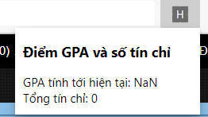

# Chrome extension tính điểm gpa và tín chỉ tới thời điểm hiện tại

## Cài đặt

Cài extension này theo cách thủ công bằng cách:
1. Vào `chrome://extensions`
2. Enable Developer Mode
3. Click Load unpacked, load thẳng folder này vào

## Cách dùng

1. Vào trang xem điểm mình thường xem, nhớ chọn chế độ `tất cả` cho phần `năm học` để coi tới thời điểm hiện tại
2. Click vào icon extension để hiển thị kết quả.

## Tính năng hiện tại:

- Tính GPA và tổng tín chỉ, đã trừ Thể dục, Anh văn, Giáo dục quốc phòng và các môn bé hơn 5 điểm

## Mong muốn thêm tính năng

Các bạn có góp ý kiến thêm cho extension này thì mở issue giúp mình nha.

Extension này còn đơn giản nên mình để đây tạm.